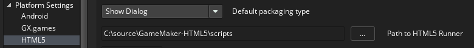
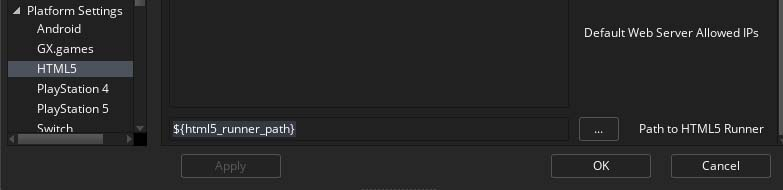

# GameMaker HTML5 Runtime

## Overview

We’re excited to open source the HTML5 runtime for GameMaker. You can view its source on GitHub and contribute to the repository.

This will allow you to better understand how the engine works, and to submit improvements for the HTML5 target.

The runtime will continue to receive updates and fixes from the GameMaker team. You’re encouraged to contribute by creating Pull Requests, which will be reviewed by our team.

## Using the Runtime

In order to use this runtime, you should clone the repository as normal, once you have the code checked out you can tell GameMaker to use it rather than its built-in copy of the runtime by changing *Path to HTML5 runner* under *Platform Settings > HTML5* on the *Preferences* screen, for example if you have the repository checked out to `C:\source\GameMaker-HTML5`:

To revert back to the built-in runner simply change the path back to `${html5_runner_path}`:

## Reporting Issues

Report bugs with the HTML5 runtime on the repository's Issues page. Whenever possible, please include an exported GameMaker project (`*.yyz`) demonstrating the issue.

Any new feature requests for GameMaker should still be submitted through the [Contact page](https://contact.gamemaker.io/), as these are not specific to the HTML5 runtime.

## Contributing

After you’ve made your changes, run your game in GameMaker using the HTML5 target, which should use your modified runtime. Make use of the Debugger and browser tools to fix any issues that might crop up.

Once you’re confident with your changes, push your changes to your forked repository, and create a Pull Request in the original repository (click on "compare across forks").

Whenever possible, please include an exported GameMaker project (`*.yyz`) with Pull Requests demonstrating your changes.

You may be asked to make changes to your source if our team finds any issues, so your pull request may not be accepted in its initial form.

We look forward to seeing your contributions!
